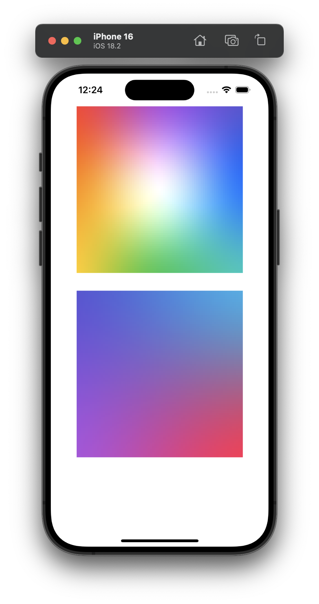

# SwiftyGradient

## MeshGradient

Аналог MeshGradient для SwiftUI - https://developer.apple.com/documentation/SwiftUI/MeshGradient

### Пример использования

```swift
let meshGradientView = MeshGradientView(width: 3, height: 3, bezierPoints: [
    .init(x: 0, y: 0), .init(x: 0.5, y: 0), .init(x: 1, y: 0),
    .init(x: 0, y: 0.5), .init(x: 0.5, y: 0.5), .init(x: 1, y: 0.5),
    .init(x: 0, y: 1), .init(x: 0.5, y: 1), .init(x: 1, y: 1)
], colors: [
    .systemRed, .systemPurple, .systemIndigo,
    .systemOrange, .white, .systemBlue,
    .systemYellow, .systemGreen, .systemMint
])

// ----

let meshGradientView2 = MeshGradientView(width: 2, height: 2, bezierPoints: [
    .init(x: 0, y: 0), .init(x: 1, y: 0),
    .init(x: 0, y: 1), .init(x: 1, y: 1)
], colors: [
    .systemIndigo, .systemCyan,
    .systemPurple, .systemPink
])
```

{width=50%}

## Скрипты

Линтер - `./Scripts/lint.sh`
